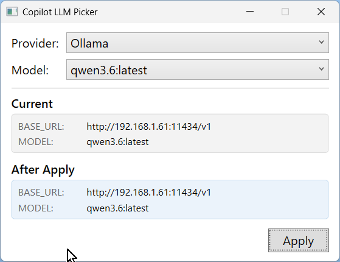

# LLMPicker

A quick way to set Environment Variables in Windows for use by GitHub Copilot CLI

**Requirements**: .NET 10 Runtime and SDK

## Configuration

In order to use it, you must first change line 13 of MainWindow.xaml.cs, which defaults to this:

```c#
private const string OllamaUrl     = "http://192.168.1.61:11434/v1";
```

This is the address of your Ollama instance.

The next thing is to change the entries in models.json to the models that your Ollama instance has access to. Here is the default:

*models.json:*

```
{
  "models": [
    "llama3.1:8b",
    "llama3.2-vision:11b",
    "deepcoder",
    "deepseek-coder:33b-instruct",
    "deepseek-r1:14b",
    "devstral",
    "devstral-small-2",
    "gemma3:12b",
    "gemma4:latest",
    "gemma4:26b",
    "gpt-oss:latest",
    "granite4.1:3b",
    "laguna-xs.2",
    "ministral-3",
    "mistral-medium-3.5:latest",
    "mistral-small3.2",
    "nemotron-cascade-2",
    "qwen2.5-coder:7b",
    "qwen2.5-coder:14b",
    "qwen3-coder:latest",
    "qwen3.6:latest",
    "qwen3:14b",
    "qwen3-coder:30b",
    "qwen3-coder-next:latest",
    "qwen3.5:latest"
  ]
}
```

Any time you add or remove a model, you must re-run the app.

More importantly, after selecting a new model, you must re-open the command window where you are running Copilot and run Copilot again.

