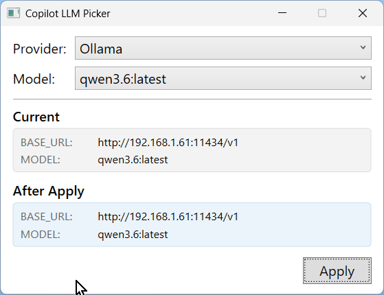

# LLMPicker

A quick way to set Environment Variables in Windows for use by GitHub Copilot CLI

**Requirements**: .NET 10 Runtime and SDK

## Configuration

Provider URLs are built from `LLMPicker/config.json`, which defaults to this:

```json
{
  "hostAddress": "192.168.1.23"
}
```

This is the IP address or host name for the local LLM machine. The app currently builds these OpenAI-compatible URLs from that host:

- Ollama: `http://<hostAddress>:11434/v1`
- FoundryLocal: `http://<hostAddress>:51331/v1`
- Llama.cpp: `http://<hostAddress>:8080/v1`

The next thing is to change the entries in `models.json` to the models that your providers have access to. Here is the default:
Llama.cpp models are discovered from `/v1/models`; `llamaCppModels` is used as a fallback if the server is unavailable.

*models.json:*

```json
{
  "models": [
    "llama3.1:8b",
    "llama3.2-vision:11b",
    "deepcoder",
    "deepseek-coder:33b-instruct",
    "deepseek-r1:14b",
    "devstral",
    "devstral-small-2",
    "gemma3:12b",
    "gemma4:latest",
    "gemma4:26b",
    "gpt-oss:latest",
    "granite4.1:3b",
    "laguna-xs.2",
    "ministral-3",
    "mistral-medium-3.5:latest",
    "mistral-small3.2",
    "nemotron-cascade-2",
    "qwen2.5-coder:7b",
    "qwen2.5-coder:14b",
    "qwen3-coder:latest",
    "qwen3.6:latest",
    "qwen3:14b",
    "qwen3-coder:30b",
    "qwen3-coder-next:latest",
    "qwen3.5:latest"
  ],
  "llamaCppModels": [
    "qwen3-coder-next"
  ]
}
```

Any time you add or remove a model, you must re-run the app.

More importantly, after selecting a new model, you must re-open the command window where you are running Copilot and run Copilot again.



